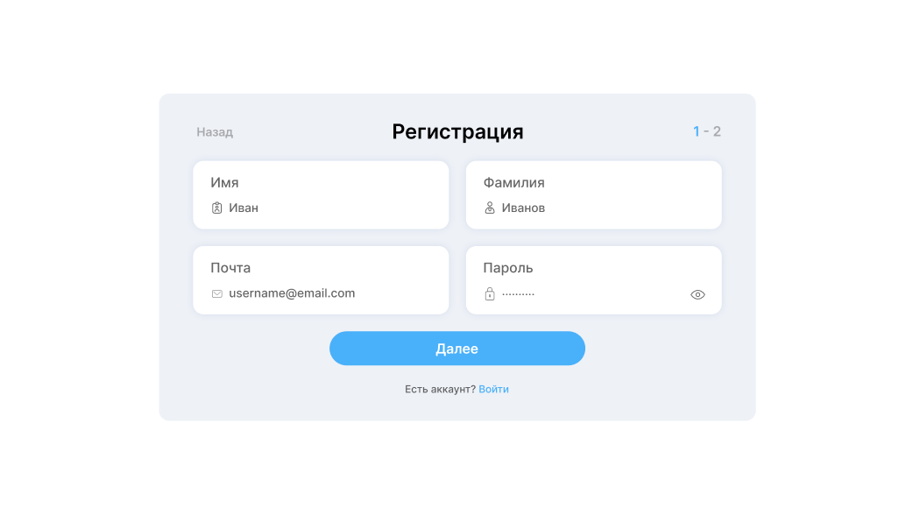
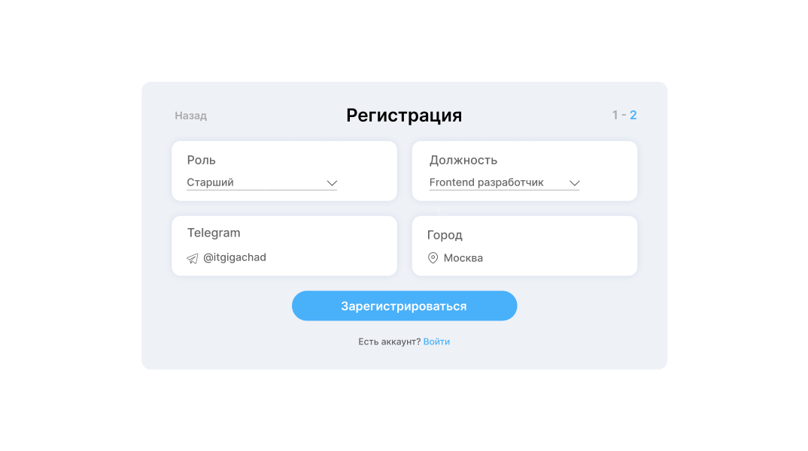
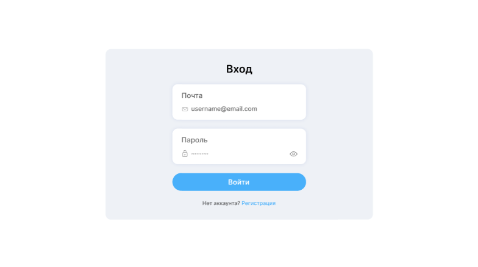
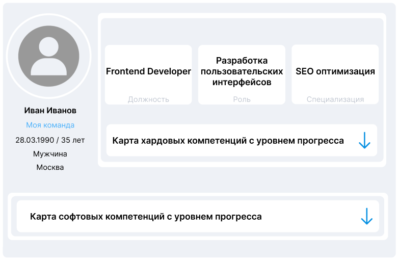
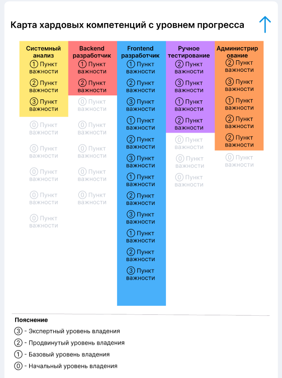
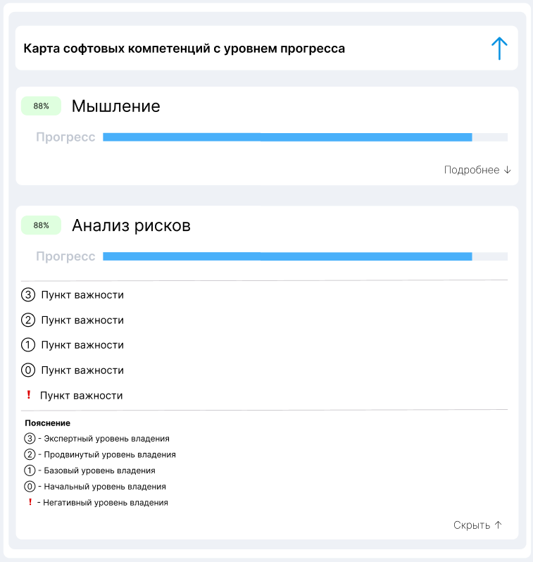
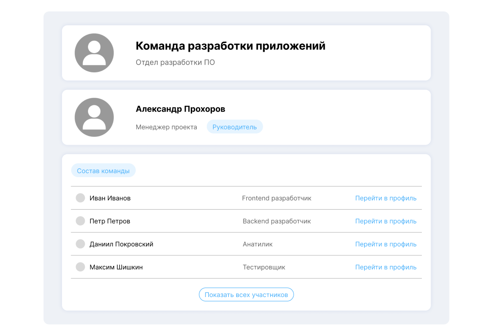
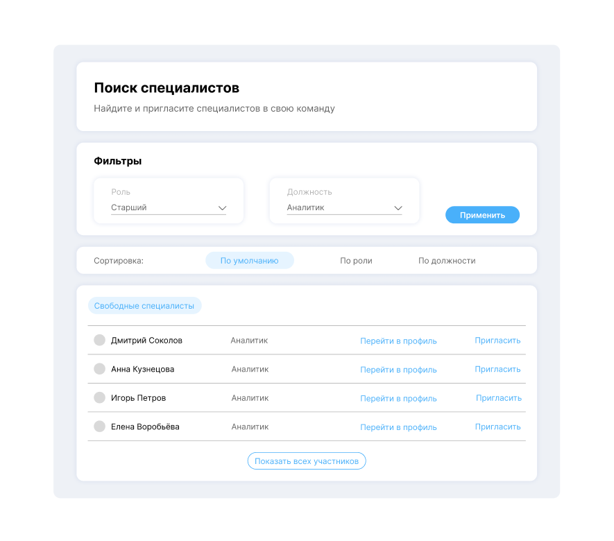

# Specialist-IT-profile

**Профиль ИТ-специалиста** - это сервис, обеспечивающий систематизацию компетенций, их описания и оценки, формирование индивидуальных профилей участников клуба, а также шаблонов профилей различного назначения.  
Состав команды:

- Логвинов Артём (Frontend-разработчик)
- Меликфашян Геворк (IT Lead, cистемный аналитик)
- Солончев Марк (Backend-разработчик)
- Наместников Владимир (Тестировщик)
- Воробьёв Александр (Технический писатель)

## Пользовательская документация

### Регистрация/авторизация

Для использования платформы нужно создать личный кабинет с помощью формы регистрации. Если личный кабиет уже существует, перейдите к этапу авторизации.
Регистрация проходит в два этапа. На первом этапе необходимо ввести следующие пользовательские данные: имя, фамилия, электронная почта, пароль, на втором - роль, должность, имя пользователя telegram, город. На рисунке 1 и 2 показаны этапы регистрации пользователя.

Далее необходимо авторизоваться, заполнив форму авторизации, как показано на рисунке 3.

### Профиль

После авторизации происходит переход в профиль специалиста, где можно посмотреть личные данные пользователя, карту хард-компетенций, карту софт-компетенций.

Личные данные пользователя в профиле можно увидеть на рисунке 4.

Карта хард-компетенций с уровнем прогресса отражает технические навыки пользователя, она имеет форму буквы Т, главная компетенция, на которой специализируется пользователь находится в середине, а по бокам - сторонние компетенции. Навыки в компетенциях имеют 4 уровня владения: начальный, базовый, продвинутый, экспертный. Эти уровни позволяют понять, насколько специалист владеет тем или иным навыком. Карту хард-компетенций можно увидеть на рисунке 5. Также пользователь может добавить себе новые навыки, уровень владения которыми оценит менеджер его команды.

Карта софт-компетенций показывает, какими надпрофессиональными качествами и насколько влияет пользователь. Уровни владения те же, что и в хард-компетенциях, но с добавлением негативного уровня владения. Карту софт-компетенций можно увидеть на рисунке 6.

### Команда

Из профиля по кнопке "Моя команда" можно перейти на страницы команды пользователя. На этой странице распологается основная информация о команде специалиста, её руководитель и таблица состава команды. Из таблицы состава команды можно перейти в профиль участника команды. Страницу команды можно увидеть на рисунке 7.

### Поиск специалистов

Если пользователь является менеджером команды, то ему становится доступна страница поиска свободных участников. На странице есть таблица свободных специалистов, для которой осуществляется фильтрация и сортировка. Отфильтровать специалистов можно по роли и должность, отсортировать - по умолчанию, по роли, по должности.

Из этой таблицы менеджер может перейти в профиль специалиста и пригласить его в свою команда по кнопке "Пригласить".

